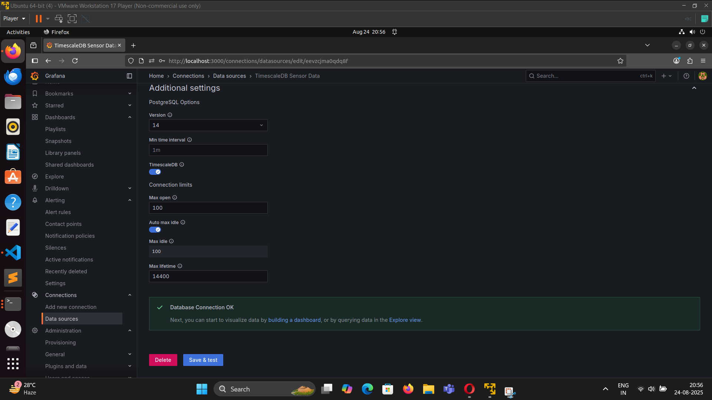
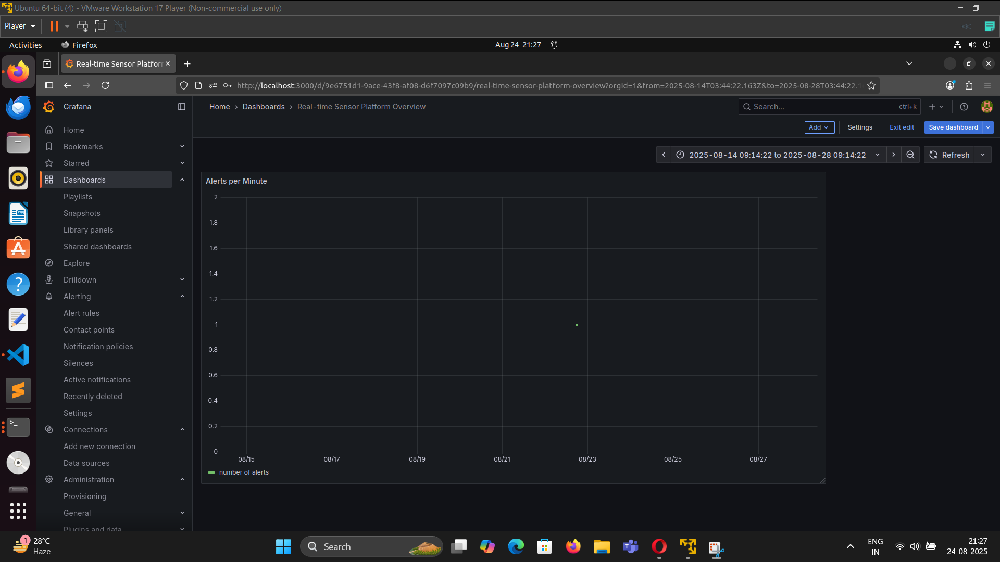
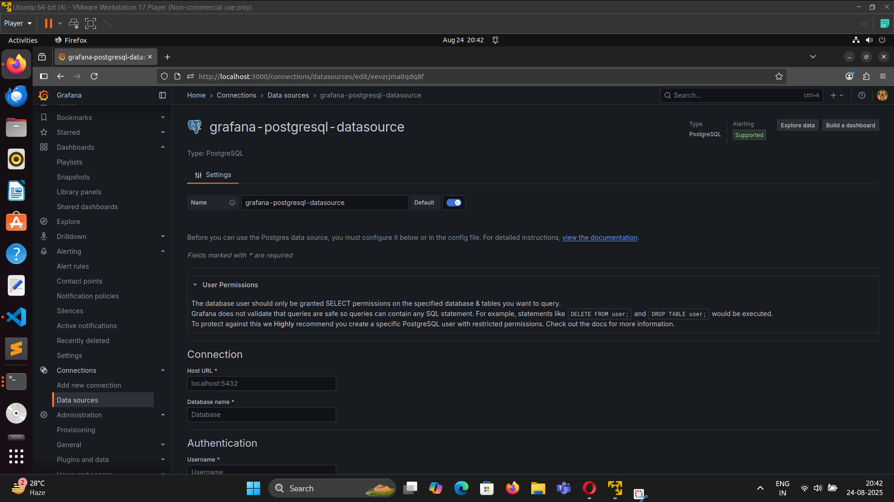
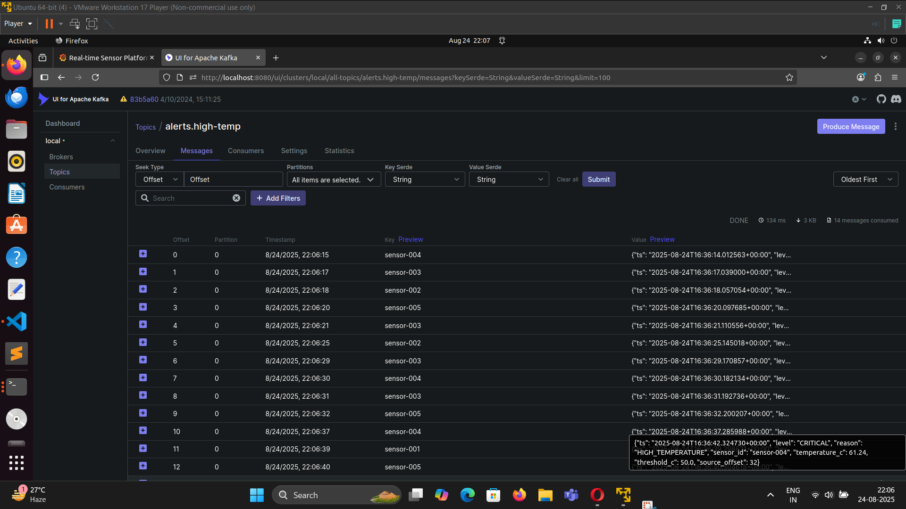

# Real-time Data Platform 🚀

A **real-time data processing and visualization platform** built with **Kafka, TimescaleDB, Grafana, and Docker**.  
This system ingests sensor data, processes it, raises alerts, and visualizes results in Grafana dashboards.

---

## 📂 Architecture Overview


---

## ⚙️ Tech Stack
- **Apache Kafka** – Event streaming backbone
- **TimescaleDB (PostgreSQL extension)** – Time-series database
- **Grafana** – Interactive dashboards and alerting
- **Docker Compose** – Service orchestration
- **Python Microservices** – Data producer, consumer, sink, and alert listener

---

## 📊 Grafana Dashboards
### Realtime Monitoring


### Database Metrics


### PostgreSQL Integration


---

## 🔌 Kafka UI


---

## 🚀 How to Run

1. Clone the repository:
   ```bash
   git clone https://github.com/Avik2024/realtime-platform.git
   cd realtime-platform
2. Start all services
  ```bash
  docker-compose up -d
3. Access the services
   ```bash
   Grafana → http://localhost:3000

Default login: admin / admin

Add PostgreSQL (TimescaleDB) as a datasource

Import dashboards from dashboards/

TimescaleDB → localhost:5432

Username: avik

Password: rivupanda

DB name: sensordb

Kafka UI → http://localhost:8080

View topics: sensor.temperatures, alerts.high-temp, etc.

Inspect messages and consumer groups
